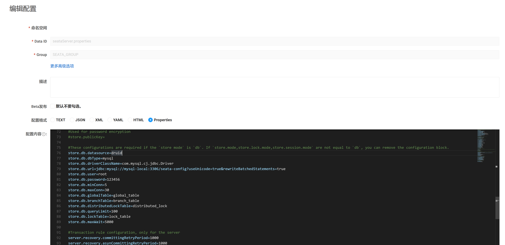
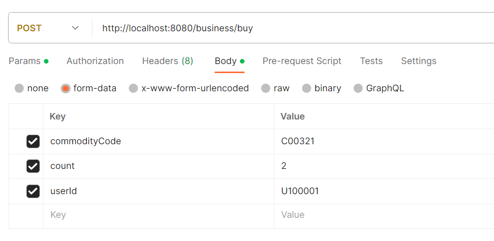

[toc]

# Spring Cloud Alibaba微服务使用seata进行分布式事务控制

采用[AT模式][]

版本依赖说明

| 依赖                      | 版本         |
|-------------------------|------------|
| [Seata][]               | 1.7.0      |
| [SpringCloud Alibaba][] | 2022.0.0.0 |
| [Nacos][]               | 2.2.3      |
| MySQL                   | 8.0.12     |
| JDK                     | 17.0.5     |
| [MyBatis Plus][]        | 3.5.4.1    |

架构图


**调用逻辑**

用户使用`Business`下单服务（接口）购买商品。

`Business`下单服务调用`Storage`库存服务扣除库存数量。

`Business`下单服务调用`Order`订单服务创建订单。

`Order`订单服务调用`Account`账户扣减用户的金额。

SEATA 的分布式交易解决方案


## 项目配置说明

### Seata服务器配置
下载Seata 1.7版本服务及源码，并解压到本地。
https://github.com/seata/seata/releases/download/v1.7.0/seata-server-1.7.0.zip

https://github.com/seata/seata/archive/refs/tags/v1.7.0.zip

配置`seata/conf`的`application.yml`文件 

> 涉及nacos及mysql数据库的配置。
```yml
#  Copyright 1999-2019 Seata.io Group.
#
#  Licensed under the Apache License, Version 2.0 (the "License");
#  you may not use this file except in compliance with the License.
#  You may obtain a copy of the License at
#
#  http://www.apache.org/licenses/LICENSE-2.0
#
#  Unless required by applicable law or agreed to in writing, software
#  distributed under the License is distributed on an "AS IS" BASIS,
#  WITHOUT WARRANTIES OR CONDITIONS OF ANY KIND, either express or implied.
#  See the License for the specific language governing permissions and
#  limitations under the License.

server:
  port: 7091

spring:
  application:
    name: seata-server

logging:
  config: classpath:logback-spring.xml
  file:
    path: ${user.home}/logs/seata
  extend:
    logstash-appender:
      destination: 127.0.0.1:4560
    kafka-appender:
      bootstrap-servers: 127.0.0.1:9092
      topic: logback_to_logstash

console:
  user:
    username: seata
    password: seata
seata:
  config:
    # support: nacos, consul, apollo, zk, etcd3
    type: nacos
    nacos:
      server-addr: nacos-local:8848
      namespace:
      group: SEATA_GROUP
      username: nacos
      password: nacos
      context-path:
      ##if use MSE Nacos with auth, mutex with username/password attribute
      #access-key:
      #secret-key:
      data-id: seataServer.properties
  registry:
    # support: nacos, eureka, redis, zk, consul, etcd3, sofa
    type: nacos
    nacos:
      application: seata-server
      server-addr: nacos-local:8848
      group: SEATA_GROUP
      namespace:
      cluster: default
      username: nacos
      password: nacos
      context-path:
      ##if use MSE Nacos with auth, mutex with username/password attribute
      #access-key:
      #secret-key:
  store:
    # support: file 、 db 、 redis
    mode: db
    db:
      datasource: druid
      db-type: mysql
      driver-class-name: com.mysql.cj.jdbc.Driver
      url: jdbc:mysql://mysql-local:3306/seata-config?rewriteBatchedStatements=true
      user: root
      password: 123456
      min-conn: 10
      max-conn: 100
      global-table: global_table
      branch-table: branch_table
      lock-table: lock_table
      distributed-lock-table: distributed_lock
      query-limit: 1000
      max-wait: 5000
#  server:
#    service-port: 8091 #If not configured, the default is '${server.port} + 1000'
  security:
    secretKey: SeataSecretKey0c382ef121d778043159209298fd40bf3850a017
    tokenValidityInMilliseconds: 1800000
    ignore:
      urls: /,/**/*.css,/**/*.js,/**/*.html,/**/*.map,/**/*.svg,/**/*.png,/**/*.jpeg,/**/*.ico,/api/v1/auth/login
```

配置nacos控制台中的`seataServer.properties`文件。
> 文件名字定义在`application.yml`中的`seata.config.nacos.data-id`定义。
> 文件的内容参考`seata/script/config-center/config.txt`文件。



```properties
#For details about configuration items, see https://seata.io/zh-cn/docs/user/configurations.html
#Transport configuration, for client and server
transport.type=TCP
transport.server=NIO
transport.heartbeat=true
transport.enableTmClientBatchSendRequest=false
transport.enableRmClientBatchSendRequest=true
transport.enableTcServerBatchSendResponse=false
transport.rpcRmRequestTimeout=30000
transport.rpcTmRequestTimeout=30000
transport.rpcTcRequestTimeout=30000
transport.threadFactory.bossThreadPrefix=NettyBoss
transport.threadFactory.workerThreadPrefix=NettyServerNIOWorker
transport.threadFactory.serverExecutorThreadPrefix=NettyServerBizHandler
transport.threadFactory.shareBossWorker=false
transport.threadFactory.clientSelectorThreadPrefix=NettyClientSelector
transport.threadFactory.clientSelectorThreadSize=1
transport.threadFactory.clientWorkerThreadPrefix=NettyClientWorkerThread
transport.threadFactory.bossThreadSize=1
transport.threadFactory.workerThreadSize=default
transport.shutdown.wait=3
transport.serialization=seata
transport.compressor=none

#Transaction routing rules configuration, only for the client
service.vgroupMapping.default_tx_group=default
#If you use a registry, you can ignore it
service.default.grouplist=127.0.0.1:8091
service.enableDegrade=false
service.disableGlobalTransaction=false

#Transaction rule configuration, only for the client
client.rm.asyncCommitBufferLimit=10000
client.rm.lock.retryInterval=10
client.rm.lock.retryTimes=30
client.rm.lock.retryPolicyBranchRollbackOnConflict=true
client.rm.reportRetryCount=5
client.rm.tableMetaCheckEnable=true
client.rm.tableMetaCheckerInterval=60000
client.rm.sqlParserType=druid
client.rm.reportSuccessEnable=false
client.rm.sagaBranchRegisterEnable=false
client.rm.sagaJsonParser=fastjson
client.rm.tccActionInterceptorOrder=-2147482648
client.tm.commitRetryCount=5
client.tm.rollbackRetryCount=5
client.tm.defaultGlobalTransactionTimeout=60000
client.tm.degradeCheck=false
client.tm.degradeCheckAllowTimes=10
client.tm.degradeCheckPeriod=2000
client.tm.interceptorOrder=-2147482648
client.undo.dataValidation=true
client.undo.logSerialization=jackson
client.undo.onlyCareUpdateColumns=true
server.undo.logSaveDays=7
server.undo.logDeletePeriod=86400000
client.undo.logTable=undo_log
client.undo.compress.enable=true
client.undo.compress.type=zip
client.undo.compress.threshold=64k
#For TCC transaction mode
tcc.fence.logTableName=tcc_fence_log
tcc.fence.cleanPeriod=1h

#Log rule configuration, for client and server
log.exceptionRate=100

#Transaction storage configuration, only for the server. The file, db, and redis configuration values are optional.
store.mode=db
store.lock.mode=db
store.session.mode=db
#Used for password encryption
#store.publicKey=

#These configurations are required if the `store mode` is `db`. If `store.mode,store.lock.mode,store.session.mode` are not equal to `db`, you can remove the configuration block.
store.db.datasource=druid
store.db.dbType=mysql
store.db.driverClassName=com.mysql.cj.jdbc.Driver
store.db.url=jdbc:mysql://mysql-local:3306/seata-config?useUnicode=true&rewriteBatchedStatements=true
store.db.user=root
store.db.password=123456
store.db.minConn=5
store.db.maxConn=30
store.db.globalTable=global_table
store.db.branchTable=branch_table
store.db.distributedLockTable=distributed_lock
store.db.queryLimit=100
store.db.lockTable=lock_table
store.db.maxWait=5000

#Transaction rule configuration, only for the server
server.recovery.committingRetryPeriod=1000
server.recovery.asynCommittingRetryPeriod=1000
server.recovery.rollbackingRetryPeriod=1000
server.recovery.timeoutRetryPeriod=1000
server.maxCommitRetryTimeout=-1
server.maxRollbackRetryTimeout=-1
server.rollbackRetryTimeoutUnlockEnable=false
server.distributedLockExpireTime=10000
server.xaerNotaRetryTimeout=60000
server.session.branchAsyncQueueSize=5000
server.session.enableBranchAsyncRemove=false
server.enableParallelRequestHandle=false

#Metrics configuration, only for the server
metrics.enabled=false
metrics.registryType=compact
metrics.exporterList=prometheus
metrics.exporterPrometheusPort=9898
```
至此Seata服务端已经配置完成。

启动Seata服务

> 启动服务前确保seata配置的相关表已经存在。本次配置的表放在的`seata-config`数据库。

进入`seata/bin`目录，运行下面命令。
```bash
seata-server.bat -m db
```

### 数据库添加表

业务表有三张。`t_account`帐户表,`t_order`订单表,`t_storage`仓储表.

可以通过seata.sql文件进行导入，记得新建名为`seata`的数据库。
为了简化逻辑，三张表放在了一个数据库中。可以通过`doc/seata.sql`脚本进行导入。
```sql
CREATE TABLE `t_account`  (
  `id` int(11) NOT NULL AUTO_INCREMENT COMMENT '自增长主键id',
  `user_id` varchar(255) CHARACTER SET utf8 COLLATE utf8_general_ci NULL DEFAULT NULL COMMENT '用户id',
  `money` int(11) NULL DEFAULT 0 COMMENT '用户余额',
  PRIMARY KEY (`id`) USING BTREE
) ENGINE = InnoDB AUTO_INCREMENT = 2 CHARACTER SET = utf8 COLLATE = utf8_general_ci COMMENT = '帐户表' ROW_FORMAT = Dynamic;

INSERT INTO `t_account` VALUES (1, 'U100001', 1000);

CREATE TABLE `t_order`  (
  `id` int(11) NOT NULL AUTO_INCREMENT COMMENT '自增长主键id',
  `user_id` varchar(255) CHARACTER SET utf8 COLLATE utf8_general_ci NULL DEFAULT NULL COMMENT '用户id',
  `commodity_code` varchar(255) CHARACTER SET utf8 COLLATE utf8_general_ci NULL DEFAULT NULL COMMENT '商品编号',
  `count` int(11) NULL DEFAULT 0 COMMENT '商品数量',
  `money` int(11) NULL DEFAULT 0 COMMENT '金额',
  PRIMARY KEY (`id`) USING BTREE
) ENGINE = InnoDB AUTO_INCREMENT = 1 CHARACTER SET = utf8 COLLATE = utf8_general_ci COMMENT = '订单表' ROW_FORMAT = Dynamic;

CREATE TABLE `t_storage`  (
  `id` int(11) NOT NULL AUTO_INCREMENT COMMENT '自增长主键id',
  `commodity_code` varchar(255) CHARACTER SET utf8 COLLATE utf8_general_ci NULL DEFAULT NULL COMMENT '商品编号',
  `count` int(11) NULL DEFAULT 0 COMMENT '商品数量',
  PRIMARY KEY (`id`) USING BTREE,
  UNIQUE INDEX `commodity_code`(`commodity_code` ASC) USING BTREE
) ENGINE = InnoDB AUTO_INCREMENT = 2 CHARACTER SET = utf8 COLLATE = utf8_general_ci COMMENT = '仓储表' ROW_FORMAT = Dynamic;

INSERT INTO `t_storage` VALUES (1, 'C00321', 100);
```

添加seata数据回滚表`undo_log`。
> seata在遇到服务异常时可以通过`undolog`表记录的进行数据回滚操作。如果业务表分散在不同的数据库中，则每个数据库都需要添加此表，这里我们只有一个名为`seata`的数据库。
> 可以通过`./doc/mysql_undo_log.sql`脚本进行导入。该表取至seata源码`seata-1.7.0-src/script/client/at/db/mysql.sql`文件。

```sql
CREATE TABLE IF NOT EXISTS `undo_log`
(
    `branch_id`     BIGINT       NOT NULL COMMENT 'branch transaction id',
    `xid`           VARCHAR(128) NOT NULL COMMENT 'global transaction id',
    `context`       VARCHAR(128) NOT NULL COMMENT 'undo_log context,such as serialization',
    `rollback_info` LONGBLOB     NOT NULL COMMENT 'rollback info',
    `log_status`    INT(11)      NOT NULL COMMENT '0:normal status,1:defense status',
    `log_created`   DATETIME(6)  NOT NULL COMMENT 'create datetime',
    `log_modified`  DATETIME(6)  NOT NULL COMMENT 'modify datetime',
    UNIQUE KEY `ux_undo_log` (`xid`, `branch_id`)
) ENGINE = InnoDB AUTO_INCREMENT = 1 DEFAULT CHARSET = utf8mb4 COMMENT ='AT transaction mode undo table';
ALTER TABLE `undo_log` ADD INDEX `ix_log_created` (`log_created`);
```
添加seata配置的相关表。该配置表不依赖业务，可以新建数据库`seata-config`库进行导入。记得与seata服务端`application.yml`中配置的一致。
> 可以通过`./doc/mysql_seata_config.sql`脚本进行导入。该表取至seata源码`seata/script/server/db/mysql.sql`。
```sql
-- -------------------------------- The script used when storeMode is 'db' --------------------------------
-- the table to store GlobalSession data
CREATE TABLE IF NOT EXISTS `global_table`
(
    `xid`                       VARCHAR(128) NOT NULL,
    `transaction_id`            BIGINT,
    `status`                    TINYINT      NOT NULL,
    `application_id`            VARCHAR(32),
    `transaction_service_group` VARCHAR(32),
    `transaction_name`          VARCHAR(128),
    `timeout`                   INT,
    `begin_time`                BIGINT,
    `application_data`          VARCHAR(2000),
    `gmt_create`                DATETIME,
    `gmt_modified`              DATETIME,
    PRIMARY KEY (`xid`),
    KEY `idx_status_gmt_modified` (`status` , `gmt_modified`),
    KEY `idx_transaction_id` (`transaction_id`)
) ENGINE = InnoDB
  DEFAULT CHARSET = utf8mb4;

-- the table to store BranchSession data
CREATE TABLE IF NOT EXISTS `branch_table`
(
    `branch_id`         BIGINT       NOT NULL,
    `xid`               VARCHAR(128) NOT NULL,
    `transaction_id`    BIGINT,
    `resource_group_id` VARCHAR(32),
    `resource_id`       VARCHAR(256),
    `branch_type`       VARCHAR(8),
    `status`            TINYINT,
    `client_id`         VARCHAR(64),
    `application_data`  VARCHAR(2000),
    `gmt_create`        DATETIME(6),
    `gmt_modified`      DATETIME(6),
    PRIMARY KEY (`branch_id`),
    KEY `idx_xid` (`xid`)
) ENGINE = InnoDB
  DEFAULT CHARSET = utf8mb4;

-- the table to store lock data
CREATE TABLE IF NOT EXISTS `lock_table`
(
    `row_key`        VARCHAR(128) NOT NULL,
    `xid`            VARCHAR(128),
    `transaction_id` BIGINT,
    `branch_id`      BIGINT       NOT NULL,
    `resource_id`    VARCHAR(256),
    `table_name`     VARCHAR(32),
    `pk`             VARCHAR(36),
    `status`         TINYINT      NOT NULL DEFAULT '0' COMMENT '0:locked ,1:rollbacking',
    `gmt_create`     DATETIME,
    `gmt_modified`   DATETIME,
    PRIMARY KEY (`row_key`),
    KEY `idx_status` (`status`),
    KEY `idx_branch_id` (`branch_id`),
    KEY `idx_xid` (`xid`)
) ENGINE = InnoDB
  DEFAULT CHARSET = utf8mb4;

CREATE TABLE IF NOT EXISTS `distributed_lock`
(
    `lock_key`       CHAR(20) NOT NULL,
    `lock_value`     VARCHAR(20) NOT NULL,
    `expire`         BIGINT,
    primary key (`lock_key`)
) ENGINE = InnoDB
  DEFAULT CHARSET = utf8mb4;

INSERT INTO `distributed_lock` (lock_key, lock_value, expire) VALUES ('AsyncCommitting', ' ', 0);
INSERT INTO `distributed_lock` (lock_key, lock_value, expire) VALUES ('RetryCommitting', ' ', 0);
INSERT INTO `distributed_lock` (lock_key, lock_value, expire) VALUES ('RetryRollbacking', ' ', 0);
INSERT INTO `distributed_lock` (lock_key, lock_value, expire) VALUES ('TxTimeoutCheck', ' ', 0);
```

### Seata客户端配置

> 各服务模块导入seata依赖
```xml
<!-- seata -->
<dependency>
    <groupId>com.alibaba.cloud</groupId>
    <artifactId>spring-cloud-starter-alibaba-seata</artifactId>
</dependency>
```
> 版本是根据`SpringCloud Alibaba`自动引入的，注意看导入后的seata版本。本次使用的是seata 1.7。

修改服务模块的`application.yml`配置文件，添加seata的配置。
```yml
seata:
  enabled: true # 是否开启spring-boot自动装配，默认为true
  application-id: ${spring.application.name}
  tx-service-group: ${spring.application.name}-tx-group
  service:
    vgroup-mapping:
      account-service-tx-group: default  # seata默认的集群名称，注意名字要和tx-service-group的值一致才行
  registry:
    type: nacos
    nacos:
      server-addr: nacos-local:8848
      namespace:
      username: nacos
      password: nacos
      cluster: default
      application: seata-server
      group: SEATA_GROUP
```

为需要进行事务管理的方法添加全局事务管理注解`@GlobalTransactional`，这里只需要添加`Business`中的方法。

```java
    @GlobalTransactional
    @Override
    public ResponseEntity<Boolean> buy(String userId, String commodityCode, Integer count) {

        // 1. 扣减库存
        storageService.deduct(commodityCode, count);

        //演示抛出异常后是否回滚
//        int a = 1/0;

        // 2. 创建订单
        Order order = Order.builder()
                .userId(userId)
                .commodityCode(commodityCode)
                .count(count).build();
        orderService.create(order);

        // 返回结果
        return ResponseEntity.ok(true);
    }
```

## 测试

通过`postman`调用`Business`的下单方法，可以发现，当调用的服务出现异常是，可以进行事务回滚。


[AT模式]: https://seata.io/zh-cn/docs/user/mode/at
[Seata]: https://seata.io/zh-cn/
[SpringCloud Alibaba]: https://sca.aliyun.com/zh-cn/
[Nacos]: https://nacos.io/zh-cn/docs/v2/quickstart/quick-start.html
[MyBatis Plus]: https://baomidou.com/
